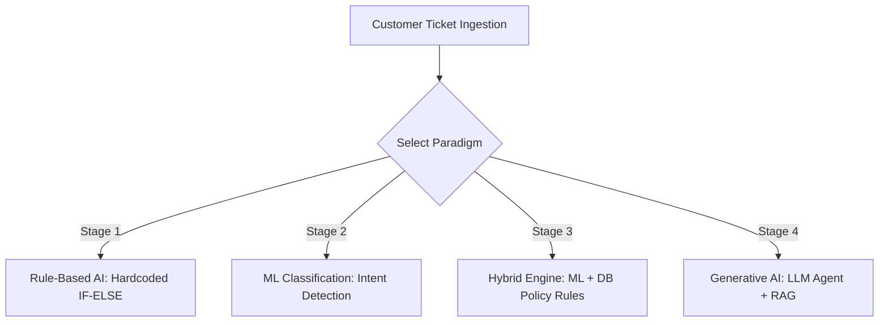
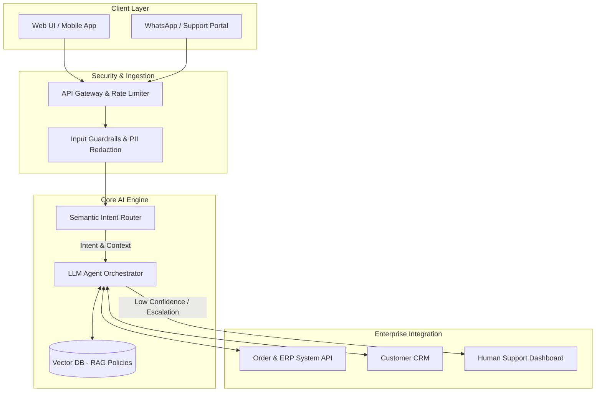
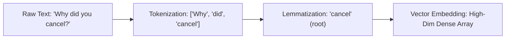

# 01. Forward Deployed Engineering (FDE) Fundamentals

---

## 🎯 1. Overview & Business Problem

A **Forward Deployed Engineer (FDE)** bridges the gap between customer problems, business logic, and scalable AI infrastructure.

### Real-World Case Study: E-Commerce Customer Support
> **Customer Query:** *"Where is my order? I received a damaged product! Can I replace my order delivered 3 days ago?"*

* **Goal:** Reduce query resolution time without compromising accuracy or customer satisfaction (CSAT).

---

## 💡 2. The 4 Evolution Stages of Support Systems



### Stage Summary
1. **Rule-Based (If-Else):** Simple string matching (`if "order status" in text`). Rigid, fails on typos/phrasing variations.
2. **ML Intent Classification:** Predicts intent category (`Order_Status`, `Refund`, `Damaged`). Identifies intent but doesn't execute actions.
3. **Hybrid Engine:** Combines ML intent classification with database checks & policy rule matrices (e.g., *7-day return policy*).
4. **Generative AI (LLMs & RAG):** Dynamic semantic understanding, self-attention, policy RAG lookup, and enterprise API tool execution.

---

## 🏗️ 3. End-to-End Enterprise FDE Solution Architecture

Below is the blueprint designed by an FDE to connect customer channels to core enterprise systems:



---

## 🧠 4. AI Hierarchy & Scope

```
+---------------------------------------------------------------+
| Artificial Intelligence (AI)                                  |
|   Any system mimicking human cognitive tasks                  |
|                                                               |
|   +-------------------------------------------------------+   |
|   | Machine Learning (ML)                                 |   |
|   |   Statistical learning from data (Features + Models)  |   |
|   |                                                       |   |
|   |   +-----------------------------------------------+   |   |
|   |   | Deep Learning (DL)                            |   |   |
|   |   |   Multi-layer Neural Networks (ANN, CNN, RNN) |   |   |
|   |   |                                               |   |   |
|   |   |   +---------------------------------------+   |   |   |
|   |   |   | Generative AI (LLMs & Transformers)   |   |   |   |
|   |   |   |   Self-Attention & Next-Token Synth   |   |   |   |
|   |   |   +---------------------------------------+   |   |   |
|   |   +-----------------------------------------------+   |   |
|   +-------------------------------------------------------+   |
+---------------------------------------------------------------+
```

---

## 🔬 5. NLP Foundations: Text to Vector Embeddings

Before raw customer text is fed into LLMs, it flows through a clean processing pipeline:



* **Tokenization:** Splits raw strings into tokens.
* **Stemming vs. Lemmatization:** Stemming truncates words (`running` $\rightarrow$ `run`), whereas Lemmatization finds dictionary roots (`better` $\rightarrow$ `good`).
* **Vector Embeddings & Attention:** Maps semantic similarity into continuous vector space so that $\text{Distance}(\vec{v}_{\text{order}}, \vec{v}_{\text{package}})$ is close, while transformer **Self-Attention** connects contextual terms across long sentences.

---

## ⚔️ 6. Quick Comparison Table

| Paradigm | Flexibility | Maintenance | Context Understanding | Automated Execution |
| :--- | :--- | :--- | :--- | :--- |
| **Rule-Based** | Rigid | High (Manual Rules) | Low (Keyword matching) | Static Scripts |
| **Traditional ML** | Moderate | Medium (Retraining) | Medium (Topic Labels) | Intent Classification |
| **GenAI / LLM Agent** | High (Zero-shot) | Low (Prompt Tuning) | High (Full Semantic) | Dynamic API Execution |

---

## 📌 Key Takeaways
- [x] FDEs own the full cycle: Problem diagnosis $\rightarrow$ Architecture design $\rightarrow$ Enterprise integration.
- [x] Rule-based systems fail at scale; GenAI agents combine RAG policies with live ERP APIs.
- [x] Vector embeddings and Self-Attention enable nuanced customer query understanding.
